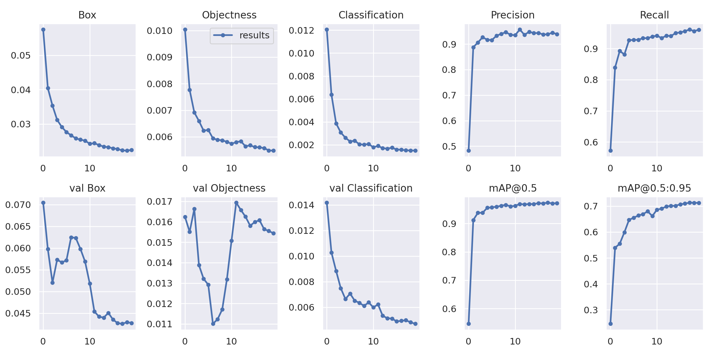
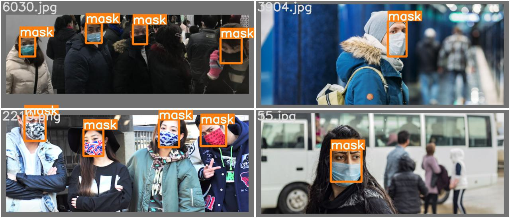
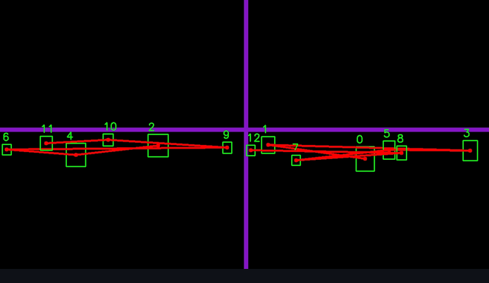
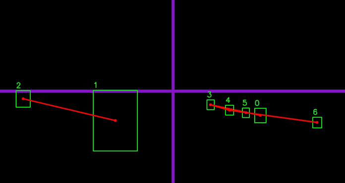
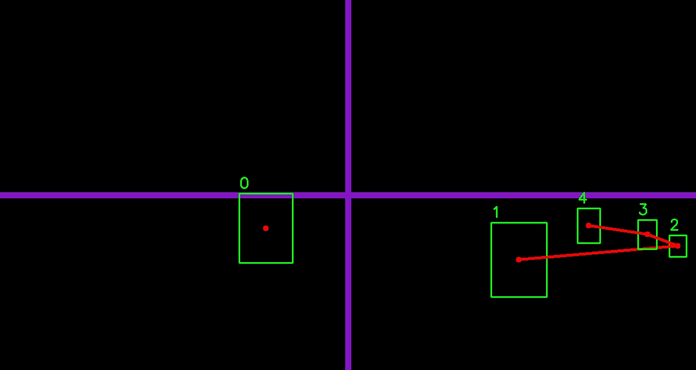

# AutoSurveillance
## Features
- Pedestrian Detection
- Social Distancing Tracking
- Wearing Mask Detection

# Demo
Loading plz wait..


# Inference Model
I have used state-of-the-art Yolov7 to detect faces and whether the face has a mask or not. It also helps in detecting how far the pedestrian is from each other. Yolov7 has outperformed its previous version, models like Faster-Rcnn, SSD, and others when it comes to inference time based on various research papers. Thus it becomes an idea to use Yolov7 for the problem as it has to perform inference on the live feed. I would have used different models and broken the problem into a piece like detecting the pedestrian and then the face but that would have increased the inference time. Yolov7 was trained on more than 4000+ images and it has performed with a MAP scored of 0.97




# Social Distancing Tracking Algorithm 
The social distancing algorithm I designed was the modification of the traditional method which uses, to calculate the Euclidean distance for one centroid to all the remaining centroid in O(nxn) and the performance was zero fps running on cpu, instead the algorithm I proposed took O(n) time to converge. Thus this leads to few frame drops on a live processed video and an average fps of 5 frames on cpu. The Algorithm works like breaking the image into subparts and simply checking if the Centroid lies in which part of the image and then checking if there is another Centroid in that part if yes the social distance rules are abused and a line is drawn from one person to the other person.

Sudo Code of the proposed Algorithm:-
```
check where the centroid lies on the image
    if the centroid on A then check if an other centorid exist on A
   	 if exist then drawn line from C1 to C2
   	 else append the centroid to the array
```




In this example figure images are broken into 4 subparts and the red line is drawn if the social distance rules are not followed

# User Interface
The User Interface and the application was developed with Streamlit. Where they can upload the video, which will be processed live and will be displayed to them or they can just use the webcam and see the live processing and the inference of the video. Streamlit provide high level api functionality to developed a web page with webrtc  technology for streaming webcam to the application


# References
[1] Chien-Yao Wang, Alexey Bochkovskiy, Hong-Yuan Mark Liao 2022 YOLOv7: Trainable bag-of-freebies sets new state-of-the-art for real-time object detectors

[2] Iram Javed 1 · Muhammad Atif Butt2 · Samina Khalid1 · Tehmina Shehryar 3 ·
Rashid Amin 4 · Adeel Muzaffar Syed5 · Marium Sadiq 12 September 2022 Face mask detection and social distance monitoring system for COVID-19 pandemic
